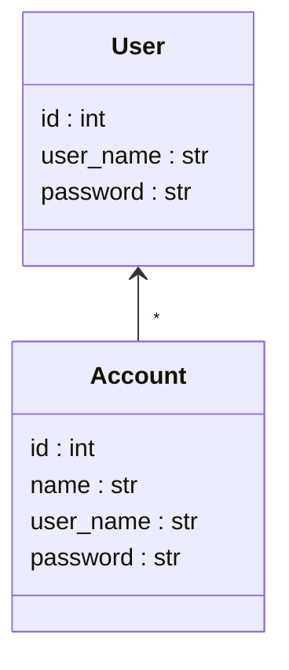
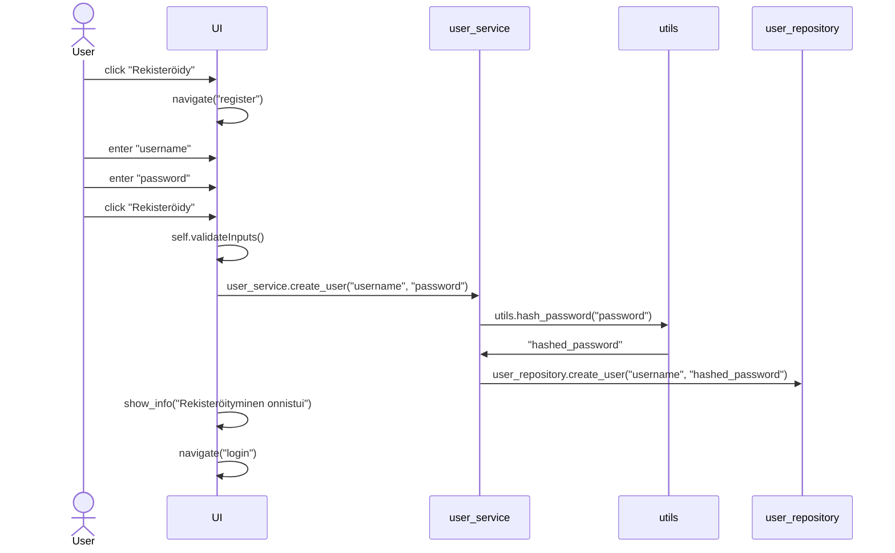
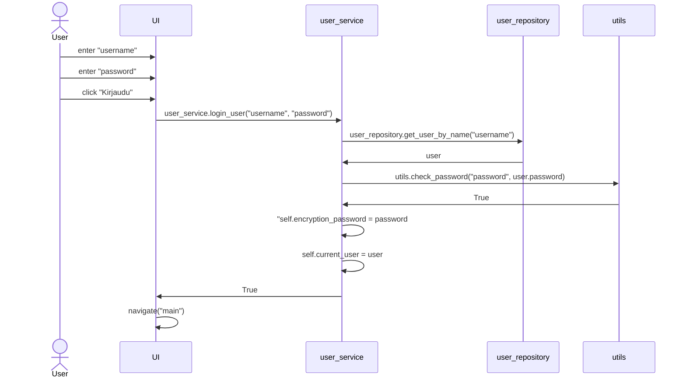
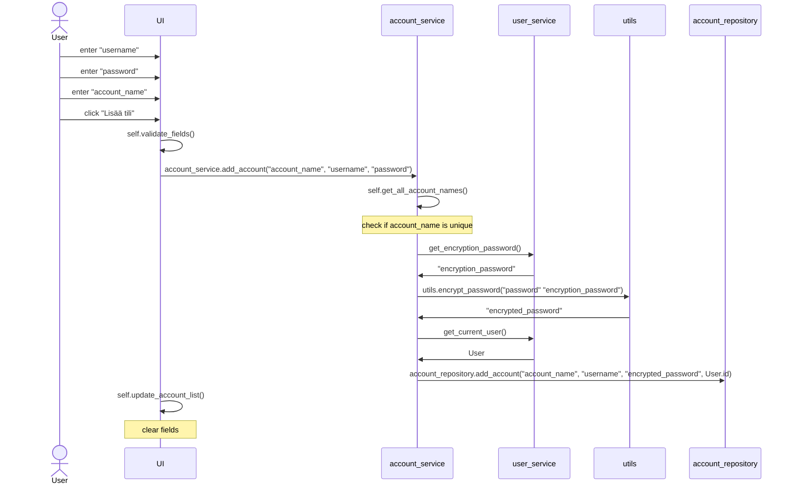

# Arkkitehtuurikuvaus

## Rakenne

Koodi on jaettu kolmeen pakkausen: `ui`, `services` ja `repositories`. Pakkaus `ui` sisältää käyttöliittymän, `services` sovelluslogiikan ja `repositories` tietokantakäsittelyn.

`ui` käyttää vain `services` luokkia, joista luodaa singletonit `user_service` ja `account_service`. 

Servicet ovat tilallisia. `user_service` sisältää kirjautuneen käyttäjän tiedot ja salasanan mitä käytetään salasanojen salausavaimen muodostamiseen.

`services` käyttää `repositories` luokkia, joista luodaan singletonit `user_repository` ja `account_repository`. 

`repositories` muokkaa tietokantaa `sqlite3` moduulin avulla. Ne eivät sisällä mitään tilaa, vaan kaikki tiedot haetaan tietokannasta ja palautetaan `services` luokille. Jos palautetaan `entity` repository luo niistä uuden olion ja palauttaa sen.

## Käyttöliittymä

Sovelluksessa on 3 näkymää `login_view`, `register_view`, `main_view.` Nämä näkymät perivät `base_view` luokan, jossa on jaettua toiminnallisuutta ja metodeja näyttää info ja error dialogeja.

`login_view` on kirjautusmis sivu, joka avautuu ensimmäisenä sovelluksen käynistyksessä.

`register_view` on rekisteröitymissivu, jossa käyttäjä voi luoda uuden käyttäjän.

`main_view` on pääsivu, jossa käyttäjä voi tarkastella tallennettuja tilejä ja tallentaan uusia.

`ui` moduuli toimii kaikkien näkymien ylänäkymänä ja vastaa navigoinnista näkymien välillä. 

## Sovelluslogiikka

Sovelluksen tietorakenteen muodostavat `User` ja `Account`

`User` sisältää käyttäjän tiedot ja `Account` sisältää tallennetun tilin tiedot.

## Salasanojen tallentaminen

Sovellus tallentaa salasanat tietokantaan salattuna symmetristä salausta `Fernet` moduulia käyttäen. Käyttäjän selkokielistä salasanasta luodaan salausavain, jonka avulla tallennetut tilien salasanat suojataan. Vain käyttäjän salasana pystyy purkamaan salauksen. 

Kun salasana pitää näyttää selkokielisenä, käytetään käyttäjän salasanaa, joka on `user_service` luokassa ja luodaan salausavain uudestaan. Tämän avaimen avulla puretaan salaus ja salasana näytetään käyttäjälle.

Käyttäjän salasanaa tarvitaan kirjautumisessa, joten se säilötään tietokantaan hashattuna käyttäen `bcrypt` kirjastoa. Tätä hashhattua salasanaa ei voi käyttää tilien salasanojen purkamiseen.

# Päätoiminnallisuudet

Seuraavat sekvenssikaaviot kuvaa sovelluksen päätoiminnallisuuksia.

## Käyttäjän Rekisteröityminen

Käyttäjä painaa  painaa "Rekisteröidy" nappia. UI navigoi rekisteröitymissivulle. Käyttäjä syöttää käyttäjänimen, salasanan ja painaa "Rekisteröidy" napppia. UI validoi ensin käyttjän syötteen ja näyttää virheilmoituksen, jos käyttäjänimi tai salasana ei vastaa vaatimuksia. Jos syöte on validi UI kutsuu `user_service` luokan `create_user` metodia. `user_service` kutsuu `utils` luokan `hash_password` metodia, joka hashaa salasanan. `user_service` luo uuden käyttäjän tietokantaan käyttäen `user_repository` luokkaa. UI näyttää info dialogin onnistuneesta rekisteöitymisestä ja navigoi kirjautumissivulle.

## Käyttäjän kirjautuminen

Käyttäjä syöttää käyttäjänimen, salasanan ja painaa "Kirjaudu" napppia. UI kutsuu `user_service` luokan `login_user` metodia. `user_service` kutsuu `user_repository` luokan `get_user_by_name` metodia, joka hakee käyttäjän tietokannasta. `user_repository` palauttaa käyttäjän `user_service` luokalle.

`user_service` kutsuu `utils` luokan `check_password` metodia, joka tarkistaa onko käyttäjän syöttämä salasana sama kuin tietokannassa oleva hashattu salasana. `utils` palauttaa `user_service` luokalle `True` jos salasanat ovat samat. 

`user_service` asettaa `self.encryption_password` muuttujan käyttäjän syöttämäksi salasanaksi ja `self.current_user` muuttujan käyttäjä olioksi. `user_service` palauttaa `True` UI:lle, joka navigoi pääsivulle.

## Uuden tilin tallentaminen

Käyttäjä syöttää tilin nimen, käyttäjänimen ja salasanan ja painaa "Lisää tili" nappia. UI validoi syötteen ja näyttää virheilmoituksen, jos syöte ei vastaa vaatimuksia. Jos syöte on validi UI kutsuu `account_service` luokan `add_account` metodia. `account_service` kutsuu `account_service` luokan `get_all_account_names` metodia, joka hakee kaikki käyttäjän tilit. `account_service` tarkistaa onko syötetty tili uniikki. Jos tili on uniikki `account_service` kutsuu `user_service` luokan `get_encryption_password` metodia, joka palauttaa käyttäjän salasanan. `account_service` kutsuu `utils` luokan `encrypt_password` metodia, joka salaa tilin salasanan käyttäen käyttäjän salasanaa. `utils` palauttaa salatun salasanan `account_service` luokalle. `account_service` kutsuu `user_service` luokan `get_current_user` metodia, joka palauttaa käyttäjän. `account_service` luo uuden tilin tietokantaan käyttäen `account_repository` luokkaa. UI kutsuu `account_service` luokan `update_account_list` metodia, joka hakee kaikki käyttäjän tilit ja päivittää UI:n tililistan. UI tyhjentää syötekentät.

## Muut toiminnallisuudet

Muut toiminnallisuudet toimivat samalla tavalla. Ui kutsuu `service`ä joka vastaa toiminnallisuudesta. Service tekee data muokkausen ja validoinnin. Service kutsuu `repository`ä joka vastaa tietokantaan tallentamisesta. 

Tiedon hakemisessa tietokannasta Ui kutsuu `service`ä joka vastaa toiminnallisuudesta. Service kutsuu `repository`ä joka vastaa tietokannasta hakemisesta. Service palauttaa datan Ui:lle.

Käyttäjän uloskirjautumisessa user_service luokka asettaa `self.current_user` muuttujan `None` arvoksi ja `self.encryption_password` muuttujan `None` arvoksi. UI navigoi kirjautumis sivulle.

## Puutteet

Tyhjää listaa klikattaessa konsoliin tulee virhe mutta se ei vaikuta käyttöön taikka kaada sovellusta. 