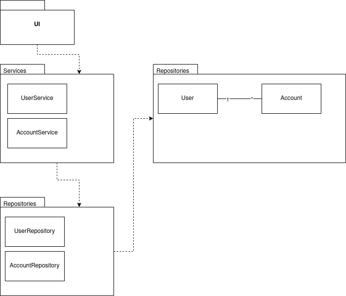
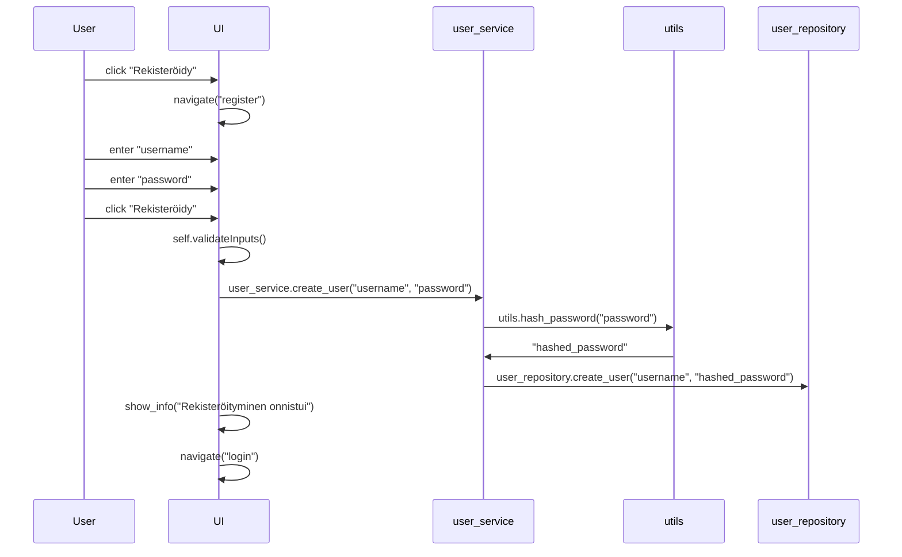

# Arkkitehtuurikuvaus

## Rakenne

Koodi on jaettu kolmeen pakkausen: `ui`, `services` ja `repositories`. Pakkaus `ui` sisältää käyttöliittymän, `services` sovelluslogiikan ja `repositories` tietokantakäsittelyn.

## Käyttöliittymä

Sovelluksessa on 3 näkymää `login_view`, `register_view`, `main_view.` Nämä näkymät perivät `base_view` luokan, jossa on jaettua toiminnallisuutta ja metodeja näyttää info ja error dialogeja.

`login_view` on kirjautusmis sivu, joka avautuu ensimmäisenä sovelluksen käynistyksessä.

`register_view` on rekisteröitymissivu, jossa käyttäjä voi luoda uuden käyttäjän.

`main_view` on pääsivu, jossa käyttäjä voi tarkastella tallennettuja tilejä ja tallentaan uusia.

`ui` moduuli toimii kaikkien näkymien ylänäkymänä ja vastaa navigoinnista näkymien välillä. 

# Päätoiminnallisuudet

## Käyttäjän Rekisteröityminen

