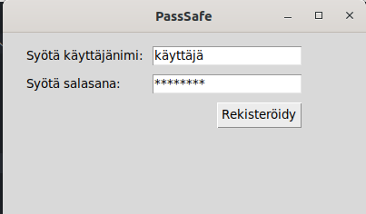
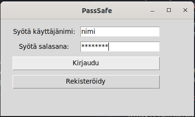
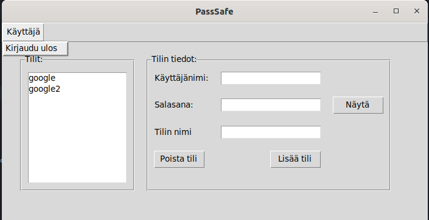
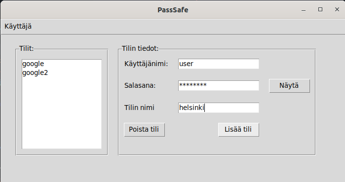
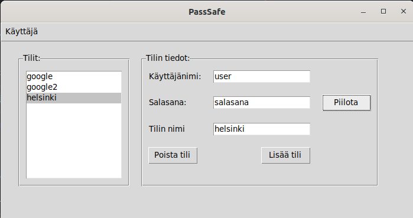
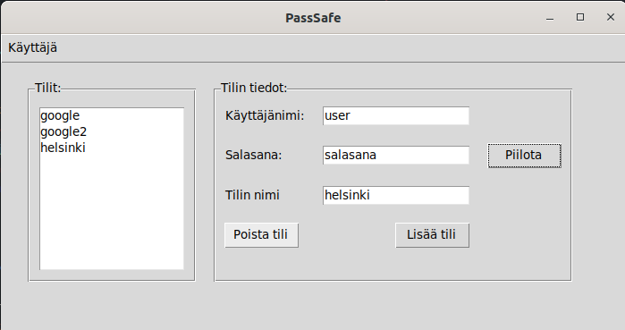

# Käyttöohje

## Sovelluksen configurointi

Kopio .env.example tiedosto .env tiedostoksi. Sieltä voi muokata tietokannan nimie, joka tallennetaa /data kansioon.

```
DATABASE_FILENAME=mydb.db
```

## Sovelluksen asentaminen

Asenna riippuvuudet komennolla

```
poetry install
```

Alusta tietokanta komennolla

```
poetry run invoke init-db
```

## Sovelluksen käynnistäminen

Sovellus käynnistetään komennolla

```
poetry run invoke start
```

## Kirjautuminen

Sovellus käynnistyy kirjautumisnäkymään, jossa käyttäjä voi kirjautua sisään tai luoda uuden käyttäjän.

## Uuden käyttäjän luominen

Uuden käyttäjän voi luoda kirjautumisnäkymästä painamalla "Rekisteröidy" nappia. Tämän jälkeen avautuu rekisteröitymissivu, jossa käyttäjä voi luoda uuden käyttäjän syöttämällä käyttäjänimen ja salasanan. Käyttäjänimen tulee olla uniikki ja salasanan tulee olla vähintään 5 merkkiä pitkä.



## Kirjautuminen sisään

Kirjautuminen onnistuu kirjautumisnäkymästä syöttämällä käyttäjänimi ja salasana ja painamalla "Kirjaudu" nappia.



## Uloskirjautuminen

Uloskirjautumien onnistuu valikosta painamalla ensin "Tili" valikko ja sitten "Kirjaudu ulos" nappia.




## Salasanan tallentaminen

Syötä käyttäjänimi, salasana ja tilin nimi ja paina lisää tili. Uusi salasan tulee näkymään listassa.



## Salasanan näyttäminen

Valitse tallennettu salasana listasta. Salasanan tiedot tulevat näkymään lomakkeeseen. Paina Näytä nappia salasanan vierestä, jolloin salasana tulee näkyviin.



## Salasanan poistaminen

Valitse poistettava salsana listasta. Paina "Poista tili" nappia. Salasanan poistuu listasta ja tietokannasta.



## Salasanan muokkaaminen

Salasanaa ei saa suoraan muokattua mutta voit poistaa vanhan salasanan ja lisätä uuden.

