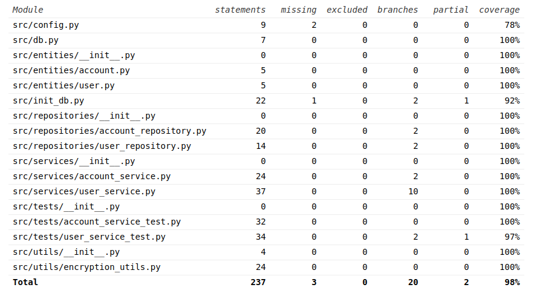

# Testausdokumentti

Ohjelman testaus on toteutettu automatisoiduilla yksikkötesteillä sekä manuaalisilla järjestelmätesteillä.

## Yksikkötestaus

### Sovelluslogiikka

Sovelluslogiikan testauksessa testataan `user_service` ja `account_service` luokkien toimintaa. Nämä luokat vastaavat sovelluksen tietojen tallentamisesta ja käsittelystä. 

Testit on toteutettu käyttäen `unittest` kirjastoa. Testit on jaettu kahteen tiedostoon `test_user_service.py` ja `test_account_service.py`.

`reposotories` tiedostoja ei testata erikseen, koska niiden testaus tulee testattua `service` luokkien kautta.

Testauksessa käytetään erillistä testitietokantaa, joka alustetaan ennen testien suorittamista ja tuhotaan testien jälkeen. Tämä varmistaa, että testit eivät vaikuta sovelluksen tietokantaan.

### Testikattavuus

Käyttöliittymää ei testata automaattisesti, koska se on toteutettu `tkinter` kirjastolla. Testikattavuusraportti on luotu `coverage` kirjastolla. 

Testikattavuus raportissa näkyy myös tiedostoja, joita ei tarvitse testata ja koitettu jättää testikattavuuden ulkopuollelle, mutta `coverage` kirjasto ei osannut jättää niitä pois raportista vaikka .coveragerc tiedostossa on määritelty ne.

Testaamatta jäi komentorivin kautta kutsuttavat funktiot.

## Järjestelmätestaus

Järjestelmätestaus on tehty manuaalisesti. Testauksessa on käyty läpi kaikki määrittelydokumentissa ja käyttöohjeessa mainitut toiminnallisuudet.

## Asennus ja konfigurointi

Sovellusta on testattu linux ympäristössä. Testauksessa on käytetty eri käyttäjätunnuksia ja tietokantoja.
