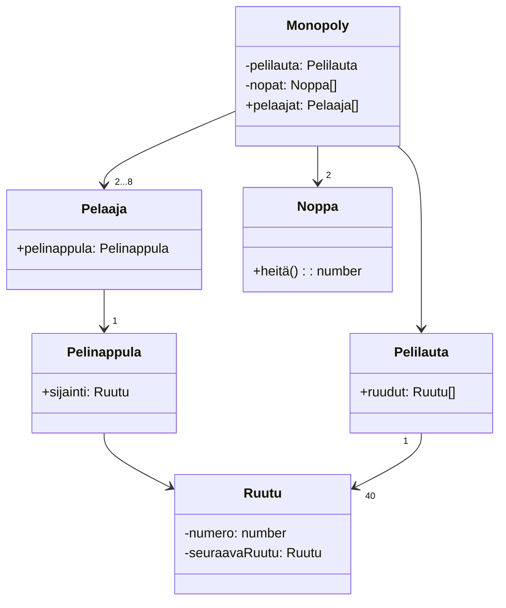

```mermaid
classDiagram
    class Monopoly {
        -pelilauta: Pelilauta
        -nopat: Noppa[]
        +pelaajat: Pelaaja[]
    }

    class Pelaaja {
        +pelinappula: Pelinappula
    }
    
    class Pelinappula {
        +sijainti: Ruutu
    }
    
    class Pelilauta {
        +ruudut: Ruutu[]
    }
    
    class Ruutu {
        -numero: number
        -seuraavaRuutu: Ruutu
    }
    
    class Noppa {
        +heitä(): number
    }
    
    Pelinappula --> Ruutu
    Pelaaja  --> "1" Pelinappula
    Pelilauta "1" --> "40" Ruutu
    Monopoly --> "2...8" Pelaaja
    Monopoly --> Pelilauta
    Monopoly --> "2" Noppa
```