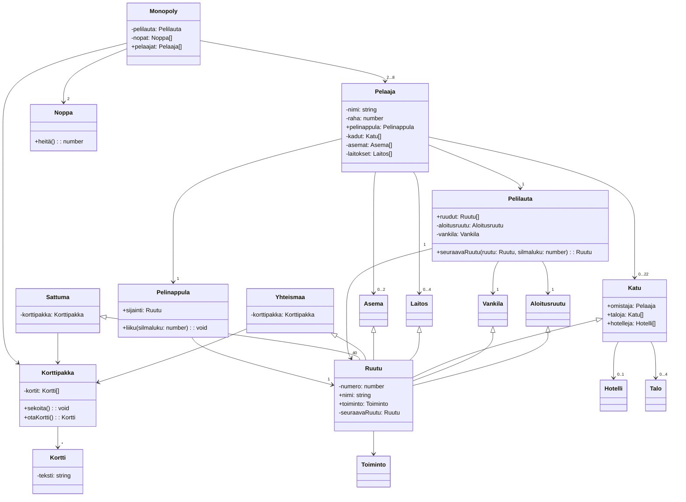

```mermaid
classDiagram
class Monopoly {
    -pelilauta: Pelilauta
    -nopat: Noppa[]
    +pelaajat: Pelaaja[]
}

class Pelilauta {
    +ruudut: Ruutu[]
    -aloitusruutu: Aloitusruutu
    -vankila: Vankila
    +seuraavaRuutu(ruutu: Ruutu, silmaluku: number): Ruutu
}

class Ruutu {
    -numero: number
    +nimi: string
    +toiminto: Toiminto
    -seuraavaRuutu: Ruutu
}

class Aloitusruutu 

class Vankila

class Sattuma {
    -korttipakka: Korttipakka
}

class Yhteismaa {
    -korttipakka: Korttipakka
}

class Asema

class Laitos

class Katu {
    +omistaja: Pelaaja
    +taloja: Katu[]
    +hotelleja: Hotelli[]
}

class Kortti {
    -teksti: string
}

class Korttipakka {
    -kortit: Kortti[]
    +sekoita(): void
    +otaKortti(): Kortti
}

class Pelaaja {
    -nimi: string
    -raha: number
    +pelinappula: Pelinappula
    -kadut: Katu[]
    -asemat: Asema[]
    -laitokset: Laitos[]
}

class Pelinappula {
    +sijainti: Ruutu
    +liiku(silmaluku: number): void
}

class Toiminto

class Noppa {
    +heitä(): number
}
    
Pelinappula --> "1" Ruutu
Pelilauta "1" --> "40" Ruutu
Pelilauta --> "1" Aloitusruutu
Pelilauta --> "1" Vankila

Monopoly --> "2" Noppa
Monopoly --> "2...8" Pelaaja
Monopoly --> Korttipakka


Ruutu --> Toiminto

Sattuma --> Korttipakka
Yhteismaa --> Korttipakka
Korttipakka --> "*" Kortti

Sattuma <|-- Ruutu
Yhteismaa <|-- Ruutu
Asema <|-- Ruutu
Laitos <|-- Ruutu
Katu <|-- Ruutu
Vankila <|-- Ruutu
Aloitusruutu <|-- Ruutu

Pelaaja --> "1" Pelinappula
Pelaaja --> "1" Pelilauta
Pelaaja -->  "0...22" Katu
Pelaaja -->  "0...2" Asema
Pelaaja -->  "0...4" Laitos

Katu --> "0..1" Hotelli
Katu --> "0...4" Talo
```